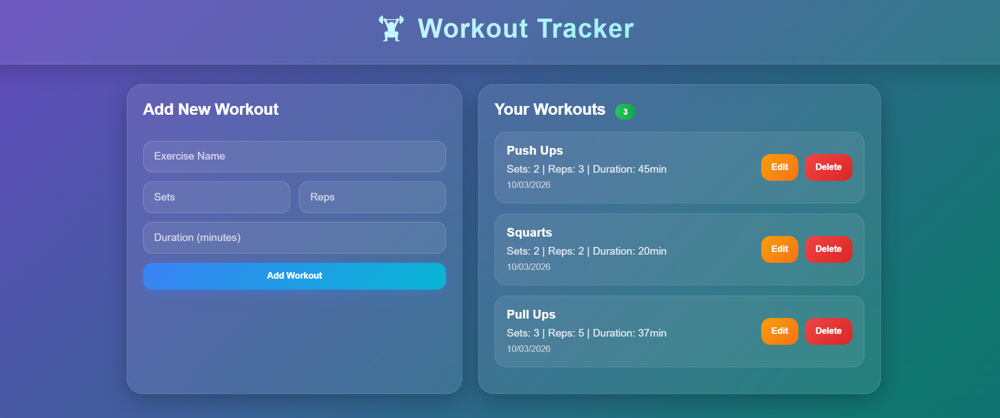

# 🏋️ Fitness Tracker Website

## 📌 Overview
Fitness Tracker is a React-based web application that helps users manage their daily workouts. Users can add, edit, and delete workout records through a simple and responsive interface.

## ✨ Features
- Add new workouts
- Edit workout details
- Delete workouts
- Display workout history
- Responsive user interface

## 🛠️ Technologies Used
- React.js
- JavaScript
- HTML5
- CSS3

## 📸 Screenshot



## 🚀 Installation

```bash
npm install
npm start
```

## 🎯 Future Improvements
- User Login
- Progress Charts
- BMI Calculator
- Diet Planner
- Backend Integration

## 👩‍💻 Author
Sulochanadevi